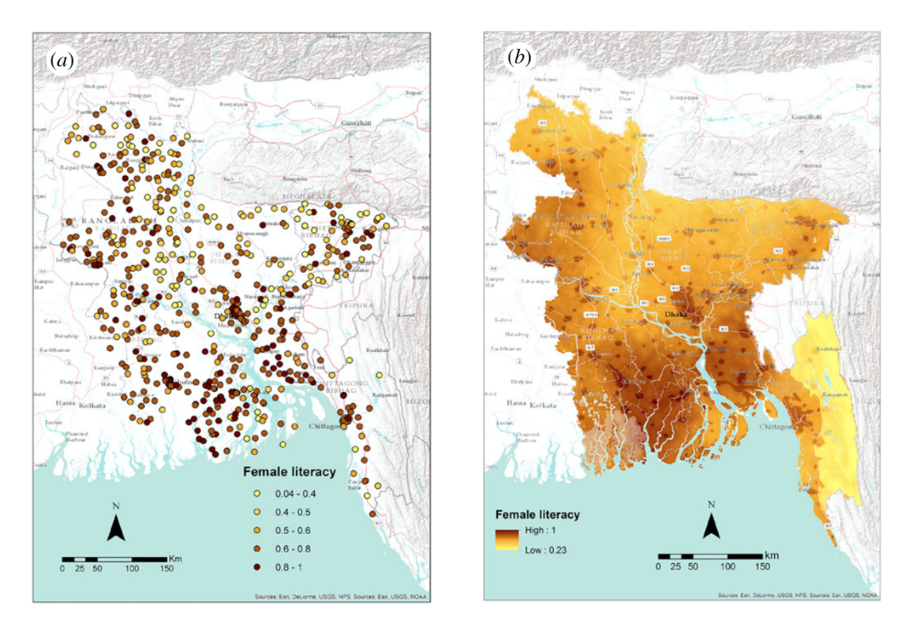

Final Word Count (Content Only): 2,617
## Quantifying Gendered Unfreedoms: Proposed Methodologies for the Resolution of the Gender Data Gap and the Enumeration of Female Wellbeing

### Introduction 

Along the path towards human flourishing and development, a tenuous balance often arises between culture and progress. Though these two processes can exist in harmony, allowing for the cultivation of a well-functioning, socially-minded society, danger rears its head when the progression of one impedes on the other – development itself depends entirely on the growth of human capabilities. When tradition begins to impinge upon the freedoms of minority groups, there is no longer leeway for historic norms to continually dictate the day-to-day life of an entire population. In recent decades, this conflict between preservation and developmental progression has risen in prominence as a topic of interest for development experts and data scientists in Southeast Asia, where longstanding patriarchal precepts dominate women’s social interactions, educational opportunities, economic activity, access to healthcare, political engagement, and human security. A brief examination of South Asia’s employment rates shows there is a shockingly low percentage (only about 20%) of female workers in Pakistan, India, and Bangladesh [1], with a significant number of women “overrepresented” in low-paying jobs that place them below the average median incomes accorded to their home countries [2]. Economic opportunities have been historically linked to mental health benefits; people with the freedom to pursue their own occupations report, on average, a higher sense of fulfillment, structure, and social engagement [3] in their day-to-day lives. Southeast Asian women barred from the workplace suffer, then, not only as a result of lacking control over fiscal resources, but also from the psychological effects of social isolation and domestic expectations of submission. Thus, the cycle of gender discrimination is compounded: female children are viewed as economic burdens from birth because it is expected that they will not engage in economic activity, which further encourages the undervaluation of girls & women as a homogenous group. 

While Southeast Asian women undeniably experience a notable decrease in wellbeing (and, according to a 2008 medical study on the role of gender in health disparity, a negation of the female “biological advantage” [4]) as a result of these linked phenomena, the rest of the region’s population suffers as well. When half of any populace is prevented from engaging in economic activity, the whole will predictably reap fewer benefits than those generated by an integrated workforce. But with significant gaps in gender-disaggregated data on economic, physical, and mental health in areas like Northern India, Nepal, Pakistan, and Sri Lanka, it is difficult to determine the true extent of gender inequality in the area. A substantial foundation of cross-tabulable, granular, high-quality, and high-coverage data is necessary to understand these countries’ progress towards gender-focused SDGs, especially as they relate to economic opportunities and female health & well-being. New research and the testing of cutting-edge technologies suggests it is possible to create such a database by synthesizing priori from existing surveys with novel mapping techniques. Data imaging produced by a combination of Bayesian generalized linear models, artificial neural networks, and repeated cross-validation processes as well as the addition of a “gender layer” to tried-and-true G.I.S. imaging could be particularly useful in generating accurate representations of social, health, and economic phenomena across both tiny pockets and large swathes of land [5]. Using these methods in tandem, an answer may be found to the following question: *how do the developmental processes of human wellbeing, economic growth, and the furthering of gender equity in Southeast Asia impact one another, and how can we quantify and better understand the links between them on a scale of enumerable indices?*

### Inquiry Type and Sub-CRQs 

Before solutions to Southeast Asia’s massive wage gaps, poor rates of political participation and representation amongst women, belittled scholastic expectations and opportunities for girls, and the female population’s lacking access to healthcare – especially in regards to sexual and mental health – are even proposed, it is vital to gain a complete and realistic understanding of spatially-diverse gender inequity. This goal can only be accomplished through an explanatory strain of inquiries that focuses on the underlying causes and predictive attributes of gender-based phenomena. Beyond identifying what is happening in terms of disaggregation in a single region’s realms of economic activity, educational opportunity, and general wellbeing, it is crucial that data scientists and development experts utilize a comparative approach to analyzing localized data, allowing for the comprehension of “why events take place; why things happen as they do; how things happen; and what… processes [are] involved” [6]. In the context of Southeast Asia’s progress towards the United Nation’s Sustainable Development Goal 5, which aims to “[end] all discrimination against women and girls” [7], this line of questioning necessitates investigating the motivations of gender inequity in modernity, including the contemporary incarnations of patriarchal norms in the workplace, healthcare centers, and stratified social settings. To enumerate this kind of qualitative data and create scalable, predictive models of both regional and global progress towards gendered development as proposed by the central research question of this paper, several questions must be answered. Firstly, *how do variations between localized economic and health phenomena on a global level relate to scaled differences of gender inequity? How can scaling inform our understanding of complex, gender-based phenomena?* Secondly, *what are the observable effects of unresolved social inequities, such as gender inequality, on overall population health and country-wide fiscal growth?* And finally, *how can the disaggregation of preexisting data and the implementation of more equitable analytical tools, such as granular, satellite-based G.I.S. imaging and predictive modelling performed by neural networks, change our understanding of gender inequality as a quantitative measure of social progress?*

### Computational Descriptions (Applied Bayesian Generalized Linear Modelling & Geographic Information Systems) 

In attempting to crack the “comparative puzzle” posed by the interconnectivity of gender-based phenomena in regions that are dominated by patriarchal cultural influences typically described in qualitative terms (e.g., Southeast Asia), it is critical that as little bias as possible is included in the process of data analysis. At the same time, however, interpreting markers of physical wellbeing, such as those indicated by rates of infectious disease contraction, malnourishment, and child stunting, is futile without a proper framework with which to examine these data. Both of these approaches – one, purely empirical in its disregard for hypothesizing, and the other, determined to preserve the three preexisting, theory-based paradigms of science described by Rob Kitchin in his article “Big Data, new epistemologies and paradigm shifts” [8] – need to be incorporated into the analysis of human development problems, lest important qualitative aspects of data of interest are lost in the translation of observed facts to crunchable figures. By considering these contextual elements of data science before applying impartial computational methods to complex, localized development problems, it may be possible to identify combinations of data mapping, machine learning, and algorithm-based systems that can cater to the specific challenges posed by the enumeration of these qualitative problems. 
In the case of calculating gender inequity in Southeast Asia, two specific methodologies that could provide definitively quantitative answers to the central research question of this paper come to mind: applied Bayesian generalized linear modelling and layered geographic information systems. 

Originally developed as a solution to a problem of inverse probability in the 18th century, British statistician Thomas Bayes’ theorem of “Bayesian probability” has since evolved to meet the demands of geospatial plotting projects and survey-based studies on human development. Though it is regarded as “one of the most theoretically and computationally challenging problems encountered in practice” [9], it is also recognized as an incredibly accurate and efficient form of predictive modelling. In the simplest of terms, the Bayesian modelling approach utilizes a combination of prior – recorded knowledge and data – and likelihood – inferring which value of an unknown parameter is most likely to generate the data on record – to calculate the posterior distribution of a productive input. This technique is considered an extension of linear mixed and generalized linear models, as it considers “dependent variables from [non-normal] distributions” as well as “both fixed and random” outcomes [10]. The actual equation involved with this process relies on the connection of a random, or stochastic, component with a separate, systemic component through a link function of θ. This can all be represented as a function in the form P(θ|D) = (P(D|θ) X P(θ))/P(D), wherein P(θ) stands for the prior, (P(D|θ) stands for the likelihood of a result given the distribution of θ, P(D) stands for the probability of a certain data point, and P(θ|D) stands for the posterior parameters determined by the equation’s result [11].

In 2017, a group of researchers funded by a subsidized foundation of the United Nations, Data2x, developed a modelling technique able to create “gender-disaggregated high-resolution maps” [5] of Kenya, Tanzania, Bangladesh, and Nigeria using a combination of Bayesian generalized linear models, artificial neural networks, and repeated cross-validation processes. Their method of applied Bayesian modelling was able to accurately identify and predict instances of social, health, wealth, and resource-based inequity amongst the female population of Southeast Asia. Instead of relying on nationwide surveys and simplified census data, the high-resolution mapping of development indicators combines geospatial covariates with correlating, pre-established data pools to more accurately predict social, health, and economic phenomena in both tiny pockets and large swathes of land. Though there are some drawbacks associated with the use of this method, C. Bosco and his team managed to chart literacy, stunting, contraception use, and income rates on various geographic scales with a relatively small margin of error “in the range of 2-30% explained variance…” – variance largely attributed to gaps in the project’s original referential datasets [5]. For instance, the high-resolution map of Bangladesh produced by this method was able to display the geographic clustering of women with little to no education alongside geospatial concentrations of stunted children, concisely linking two distinctive indicators of development. Seeing as how almost 40% of Bangladesh’s population under the age of 5 are reported to have stunted growth – and considering that children with uneducated mothers “are more than twice as likely to be short for their age” [5] – this map, and similarly modelled depictions of data, could prove to be an extremely useful tool in the demonstration and prediction of eventual progress towards a more aggregated future in terms of gendered development. 

*The findings of C. Bosco’s 2017 study, demonstrated on a map of indicators of gender inequity in Bangladesh formed by spatially-interpolated data clusters. (Credit: J. R. Soc. Interface, 2017. http://dx.doi.org/10.1098/rsif.2016.0825)*

A secondary approach that data scientists might consider as a candidate for quantifying inequity comes in the form of G.I.S. As a method of organizing information, geographic information systems (G.I.S.) are highly-accurate and descriptively expansive, tying together different types of variables – including spatially referenced, video archival, and demographic data – with locational attributes in order to map and manipulate them. Without enough information, though, G.I. systems can be of no use, as in the case of gender-disaggregated development in southeast Asia. One of the major issues with ensuring equity for women in “undeveloped” locales in this region like Nepal, Bangladesh, and Sri Lanka stems from the lack of high-quality data collected on the topic. This problem can be directly linked to low rates of involvement amongst women in the field of data science, which has led to the long-term incubation of inherent bias in modern data collection tools. However, even when women are directly involved with the collection of data – as in the case of a GSI-based breast cancer research project conducted in Long Island, New York in 2002 – much of it ultimately ends up being filtered out or disregarded by the intrinsically-biased criteria of geographic databases. Applying an equation of scale to the rates of female inclusivity in this project (a project notably based in the so-called “developed” West) would likely reveal infinitesimally smaller percentages of gender equity in the field of data science in “less developed” regions like Southeast Asia. 
In a peer-reviewed article published in 2005, authors Keith Bosak and Kathleen Schroeder discuss in detail the wide-scale use of land-use oriented mapping programs to further research and progress within the realm of gendered development. Bosak and Schroeder’s personal research, funded by the Consultative Group on International Agricultural Research, presents a partial solution to the central research question of this paper by suggesting the combination of traditional GIS with contextual information, a process they tested “to determine ‘hot-spots’ of female poverty in Nepal, Bolivia, and Malawi” [12]. Most household surveys, which are typically referenced by G.I.S. to calculate geotagged poverty measures, “mask inequality within households” [12] and amongst family members, failing to recognize important data like income disparity between husbands and wives. Recognizing this bias, researchers can adjust their analysis of data to generate more sophisticated indicators of development based on gendered experiences in GIS databases, a technique Bosak and Schroeder applied to their own research on the women of Nepal’s Eastern Terai region. Though the area is regarded as the country’s “most agriculturally productive women,” the female workers and housewives living there are recorded to have the “lowest average body mass of any region” [12]. Relying on national data or even non-disaggregated regional data to examine malnourishment amongst Nepalese farming populations, a GIS would not be able to predict these results, indicating its shortcomings as a solely quantitative modelling tool. Similar deviations between the fiscal, physical, and social health of men and women across southeast Asia are also often overlooked by “old-school” methods of data collection. However, by layering a series of localized partial perspectives – in simpler terms, a sort of data filter sensitive to reported instances gender-specific phenomena – over geospatial data collected using an approach of positivist epistemology, Bosak and Schroeder argue that a “more objective representation of reality” can emerge [12], allowing for a more accurate vision of development within the context of southeast Asian cultural norms. 

### Conclusion, Reflection on CRQ & Sub-CRQs, and Literature Gaps 

As evidenced by the work of C. Bosco and Bosak & Schroeder, it is more than possible to quantify gender-disaggregated phenomena, regardless of if it is occurring on a localized or global scale, if it appears in the market or on social media, or if it is regularized or a rarity. Their research, as well as the ongoing research of other feminist-minded data scientists and geographers, has set the foundation for the routine quantification of complex data. Through the continuation of similar studies, it will be easier than ever for development experts to utilize exponential equations of scale and, in turn, find new ways to represent the relationship between key hallmarks of human progress as they present themselves – or fail to present themselves – in “developed,” “developing,” and “undeveloped” progress. Once applied, scaling can help create more accurate timelines for SDGs across the globe, predict and plot instances of impactful gender inequity in areas where there is little to no data on women’s activity, and depict feminism in a new light as a quantifiable necessity for development. However, there is still an unignorable trend of invisibility when it comes to female-focused data, which is integral to the formation of predictive algorithms. This apparent literature must be addressed in order for the methodologies proposed in this paper to achieve relevant, understandable, and usable results. Thus, a quandary arises: how can feminist-minded data scientists, geographers, and developmental experts hope to a) eliminate gender-based bias from such set-in-stone methods of data collection, and b) alleviate the massive discrepancies between the available data on female populations in “developed” versus “undeveloped” parts of the world? Political scientist Constance Citro stated it best when she declared that development projects “must move from [the] sample survey paradigm of the past 70 years to a mixed data sources paradigm for the future” [13]. Ultimately, this shift will not be enticed by the application of any advanced machinery, algorithms, or modelling programs. Hopefully, this report proves that the tools for resolving one of the largest roadblocks to the achievement of the United Nations’ Sustainable Development Goal No. 5 – achieve gender equality and empower all women and girls – are already close at hand, if not within humanity’s collective grasp already. However, there is only so much “big data” can do – in the end, development depends on humans. 

### References 

[1] Strachan, Glenda, et al. “Gender (In)Equality in South Asia: Problems, Prospects and Pathways.” *South Asian Journal of Human Resources Management*, 2015. https://doi.org/10.1177/2322093715580222. 

[2] Ortiz-Ospina, Esteban and Roser, Max. “Economic inequality by gender.” *Our World in Data*, Mar 2018. https://ourworldindata.org/economic-inequality-by-gender. 

[3] Niaz, Unaiza and Hassan, Sehar. “Culture and mental health of women in South-East Asia.” *World Psychiatry*, Jun 2006, vol. 5, no. 2, pp. 118-120. *PubMed Central*, https://www.ncbi.nlm.nih.gov/pmc/articles/PMC1525125/. 

[4] Fikree, Fariyal F. and Pasha, Omrana. “Role of gender in health disparity: the South Asian context.” *The BMJ*, Apr 2004, vol. 328, pp. 823-826. *PubMed Central*, https://www.ncbi.nlm.nih.gov/pmc/articles/PMC383384/. 

[5] Bosco, C., et al. “Exploring the high-resolution mapping of gender-disaggregated development indicators.” *J. R. Soc. Interface*, 2017. http://dx.doi.org/10.1098/rsif.2016.0825. 

[6] “Developing a central research question or statement.” *MESHGuides*, http://www.meshguides.org/guides/node/468. 

[7] “Goal 5: Gender equality.” *United Nations Development Programme*. https://www.undp.org/content/undp/en/home/sustainable-development-goals.html. 

[8] Kitchin, Rob. “Big Data, new epistemologies and paradigm shifts.” *Big Data & Society*, 1 April 2014, pp 1-12. Sage Journals, https://doi.org/10.1177/2053951714528481. 

[9] Chen, Ming Hui, et. al. “Bayesian Variable Selection and Computation for Generalized Linear Models with Conjugate Priors.” *Bayesian Analysis*, vol. 3, no. 3, 2007, pp. 586-613. *Project Euclid*, https://projecteuclid.org/euclid.ba/1340370439. 

[10] Ojo, Oluwatobi Blessing, et. al. “Bayesian generalized linear mixed modeling of Tuberculosis using informative priors.” *PLOS One*, 3 Mar 2017, https://doi.org/10.1371/journal.pone.0172580. 

[11] “Bayesian Statistics explained to Beginners in Simple English.” *Analytics Vidhya*, 20 Jun 2016, https://www.analyticsvidhya.com/blog/2016/06/bayesian-statistics-beginners-simple-english/. 

[12] Bosak, Keith and Schroeder, Kathleen. “Using Geographic Information Systems (GIS) for gender and development.” *Development in Practice*, Apr 2005, vol. 15, no. 2, pp. 231-247. *JSTOR*, https://www.jstor.org/stable/4030084?seq=1#metadata_info_tab_contents. 

[13] Lopes, Claudia A. and Bailur, Savita. “Gender Equality and Big Data – Making Gender Data Visible.” *United Nations Entity for Gender Equality and the Empowerment of Women*, Jan 2018. *UN Women*, https://www.unwomen.org/en/digital-library/publications/2018/1/gender-equality-and-big-data. 
